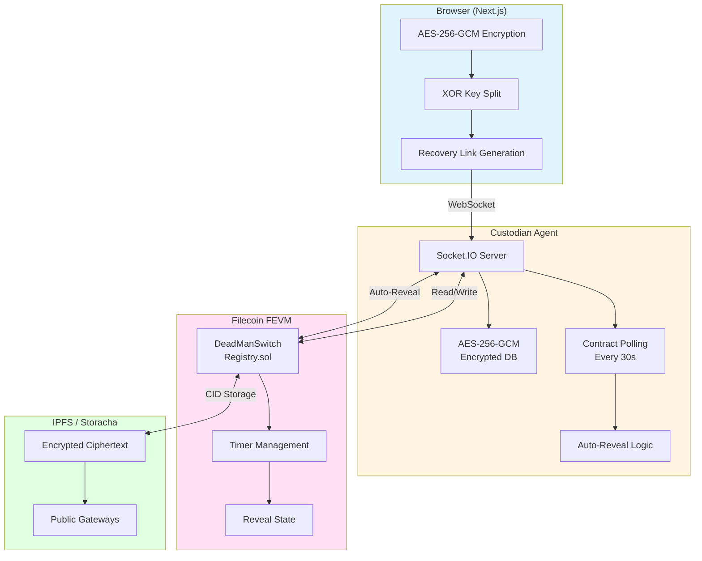
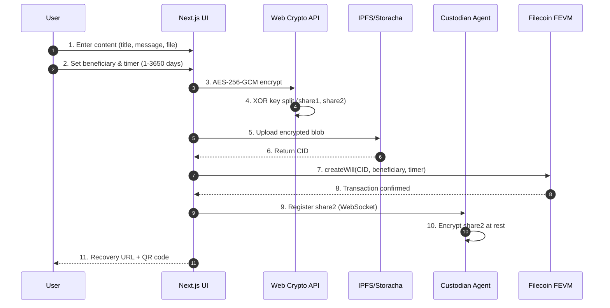
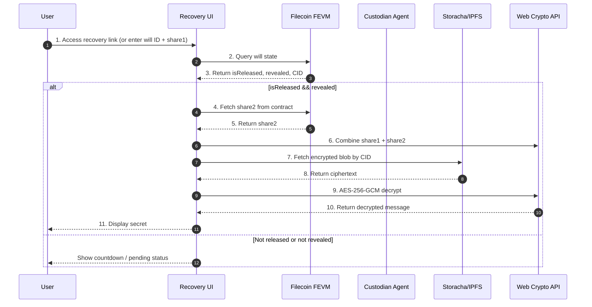

# SafeDrop -- Developer Handoff Document

## 1. What SafeDrop Is

SafeDrop is a trustless dead man's switch dApp on Filecoin. A user (the "owner") writes a secret message, encrypts it client-side with AES-256-GCM, XOR-splits the key into two shares, stores the ciphertext on IPFS via Storacha, and registers the will on the Filecoin blockchain with an inactivity timer. An autonomous Custodian Agent holds share2 off-chain (encrypted at rest), monitors the contract every 30 seconds, and auto-reveals share2 on-chain when the timer expires. The beneficiary combines both shares from the recovery link + on-chain data to decrypt.

The app runs on Filecoin Calibration Testnet. The frontend deploys to Vercel; the Custodian Agent deploys to Render as a background service.

---

## 2. Architecture Overview



| Layer | Technology | Purpose |
|-------|-----------|---------|
| Encryption | Web Crypto API (AES-256-GCM) | Client-side encrypt/decrypt. XOR key splitting. |
| Key Split | XOR (one-time pad) | Share1 in recovery link, share2 held by agent |
| Storage | Storacha / IPFS | Encrypted ciphertext blobs. Public gateway for reads. |
| Blockchain | Filecoin FEVM (Solidity) | CID, beneficiary, timer, reveal state. |
| Agent | Node.js + Socket.IO + viem | Holds share2 encrypted at rest, polls contract, auto-reveals |
| Agent DB | SQLite + Prisma | Encrypted share2 storage (AES-256-GCM with HKDF key derivation) |

**Frontend:** Next.js 16 (App Router), React 19, Tailwind CSS 4, shadcn/ui, Framer Motion, Zustand, wagmi v3, viem v2.

---

## 3. XOR Key-Split Security Model

A single AES-256 key is split into two shares via XOR (one-time pad). Neither share alone reveals any information about the key -- information-theoretically secure.

| Share | Location | Format | Who holds it |
|-------|----------|--------|-------------|
| share1 | Recovery link URL fragment (`#s1=<base64>`) | Base64, 32 bytes | Beneficiary (via QR/link) |
| share2 | Custodian Agent DB (encrypted at rest) → on-chain after release | Hex-encoded | Agent → blockchain |

**Dual flow on creation:**
- **Agent online:** share2 sent to agent via WebSocket + empty `0x` to contract. Agent stores AES-256-GCM encrypted share2 in SQLite.
- **Agent offline (v1 fallback):** share2 hex stored directly in contract's `encryptedKey` field.

**Three release states:**

| State | `isReleased` | `revealed` | UI Behavior |
|-------|-------------|-----------|-------------|
| Active | `false` | `false` | Countdown, decrypt blocked |
| Released, Awaiting Reveal | `true` | `false` | Agent auto-detects, reveals share2 |
| Released + Revealed | `true` | `true` | Beneficiary combines shares, decrypts |

---

## 4. Custodian Agent

**Location:** `mini-services/custodian-agent/`
**Documentation:** `mini-services/custodian-agent/agent.md`

### What It Does
1. Accepts share2 registrations via WebSocket
2. Stores share2 encrypted at rest in SQLite (AES-256-GCM)
3. Polls contract every 30s for released-but-unrevealed wills
4. Auto-calls `revealShare()` on-chain when release detected
5. Broadcasts real-time events to connected frontends

### Encryption at Rest
- `DB_ENCRYPTION_KEY` env var → explicit master key (64 hex chars)
- Or derives from `AGENT_PRIVATE_KEY` via HKDF-SHA256 (one secret, two independent purposes)
- Per-record random IV, AES-256-GCM with auth tag (tamper detection)
- Wrong key or tampered data → graceful null return, no crash

### Deployment

#### Live Deployments

| Service | URL | Platform |
|---------|-----|----------|
| **Frontend UI** | https://safe-drop-testnet.vercel.app/ | Vercel |
| **Custodian Agent** | https://safedrop-zhu9.onrender.com/ | Render |

#### Environment Variables

**Frontend:**
- `NEXT_PUBLIC_AGENT_URL` → deployed agent URL (empty = sandbox proxy mode)

**Agent:**
- `AGENT_PRIVATE_KEY` → Agent's wallet private key
- `DB_ENCRYPTION_KEY` → 64 hex chars for AES-256-GCM encryption at rest
- `PORT` → Server port (default: 3001)
- `SOCKET_PATH` → WebSocket path (default: /socket.io)

**Health Check:**
- `GET /health` returns JSON for container orchestration

---

## 5. Create Will Flow



**4-step wizard in `create-safe-form.tsx`:**

1. **Content** — title, message, optional file (max 10MB)
2. **Recipient & Timer** — beneficiary address, 1-3650 days timeout
3. **Review & Execute** — three-phase pipeline:
   - **Encrypt:** AES-256-GCM with owner address as AAD → XOR key split
   - **Upload:** Encrypted blob to Storacha/IPFS
   - **Sign:** Transaction to contract (agent flow: empty `0x` for share2, register with agent after TX confirms)
4. **Complete** — Recovery URL + QR code generated

---

## 6. Recovery Flow



**Three modes in `recover-safe.tsx`:**
- **Recovery link:** auto-parses `?view=recover&willId=123#s1=<share1>` from URL
- **Manual entry:** user enters will ID + share1
- **Browse chain:** user enters owner address, lists all wills

Decryption only when `isReleased && revealed`: combine shares → fetch IPFS blob → AES-256-GCM decrypt.

---

## 7. Contract Details

**Contract:** `DeadManSwitchRegistry.sol`
**Address:** `0x06f14713198eA009fC98246164159e41C7Ec3A0B`
**Network:** Filecoin Calibration (chain ID 314159)

### Key Functions
| Function | Access | Purpose |
|----------|--------|---------|
| `createWill` | payable, anyone | Register will with CID, beneficiary, timer |
| `checkIn` | owner | Reset timer |
| `ownerRelease` | owner | Early release (skip timer) |
| `triggerRelease` | anyone | Trigger after timeout |
| `revealShare` | anyone | Store share2 on-chain (after release, once only) |
| `claimWill` | beneficiary | Claim funds after release |

**Security:** OpenZeppelin ReentrancyGuard, custom errors, FEVM gas cap at 1B.

---

## 8. File Structure

**Detailed file listing:**

```
src/
  app/
    page.tsx                    # SPA shell
    layout.tsx                  # Root layout
    globals.css                 # Global styles
  lib/
    crypto.ts                   # AES-256-GCM, XOR split/combine, recovery URL
    contract.ts                 # ABI, types, explorer URLs
    agent-client.ts             # Socket.IO client (sandbox + deployed modes)
    wagmi.ts                    # Chain config, contract address
    storacha.ts                 # Storacha IPFS wrapper
  store/
    safedrop-store.ts           # UI state, view routing
    storacha-store.ts           # IPFS connection state
  hooks/
    use-dead-mans-switch.ts     # All wagmi hooks (reads + writes)
  components/safedrop/
    hero.tsx                    # Landing hero (key-split animation)
    how-it-works.tsx            # 5-step explainer
    features.tsx                # 6 feature cards
    use-cases.tsx               # Use case examples + CTA
    agent-panel.tsx             # Agent status badge + dashboard panel
    create-safe-form.tsx        # Create wizard (dual agent flow)
    recover-safe.tsx            # Recovery (3 modes)
    my-safes.tsx                # Dashboard with agent panel
    navbar.tsx, footer.tsx      # Navigation

mini-services/custodian-agent/
  index.ts                     # Socket.IO server + polling + auto-reveal
  crypto.ts                    # AES-256-GCM encrypt/decrypt at rest
  prisma/schema.prisma         # WillShare model (encrypted share2)
  agent.md                     # Full documentation
  .env.example                 # Environment variables template
```

---

## 9. Known Limitations

- **Testnet only** — contract, tFIL, Storacha are all testnet data
- **IPFS persistence** — Storacha provides redundancy but not permanent pinning guarantees
- **Agent trust** — share2 holder must reveal honestly (mitigated by auto-reveal)
- **File size** — 10MB max per file (browser encryption bottleneck)
- **Storacha auth** — requires email verification per origin (IndexedDB isolation)

---

## 10. Key Dependencies

| Package | Version | Used For |
|---------|---------|----------|
| `wagmi` | ^3.6.0 | FVM wallet + contract interaction |
| `viem` | 2.x | ABI, types, event decoding |
| `@storacha/client` | ^2.1.3 | IPFS upload/download |
| `socket.io-client` | ^4.8.3 | Custodian agent WebSocket |
| `zustand` | ^5.0.6 | Client state stores |
| `qrcode.react` | ^4.2.0 | Recovery link QR codes |
| `framer-motion` | ^12.23.2 | Animations |
| `next` | ^16.1.1 | App framework |
